# Core Concepts

### Lecture-12: Docker vs ContainerD

CRI-Container runtime interface: allowed any vendor to work as a container runtime for Kubernetes.

OCI standards: OCI stands for Open Container Initiative, which is a single interface used to connect CRI compatible 
container runtimes, and it consists of an imagespec and a runtimespec.
    1. Imagespec means the specifications on how an image should be built. So that's what it defined. An imagespec
    defined the specifications on how an image should be built,

    2. Runtimespec defined the standards on how any container runtime should be developed.

1. Docker container runtime called runC, the daemon that managed runC that was called as ContainerD.
So Docker is deprecated by k8s in 1.24 release, and containerD can be use as runtime engine. 
2. nerdCTL is docker-like CLI fo contanerD. but you have to use 'nerdctl' keyword instead of 'docker'
  
   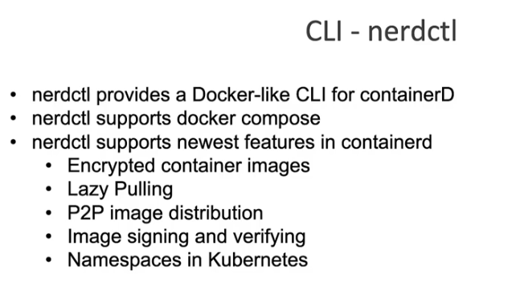<br>
   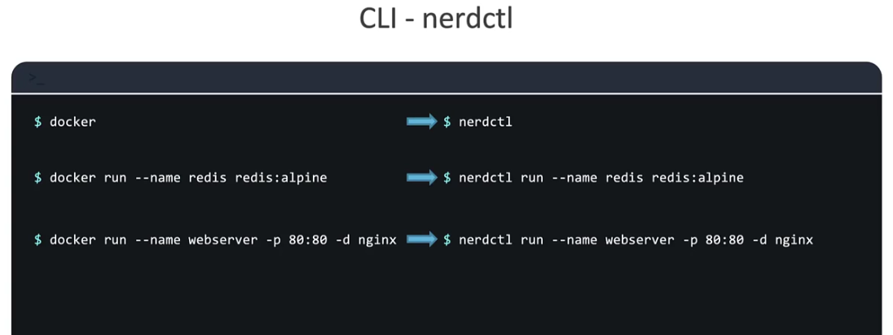<br>
   'crictl' control is a command line utility that is used to interact with the CRI compatible container runtime.
3. 
   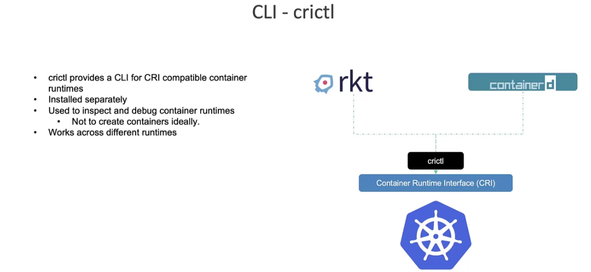<br>
   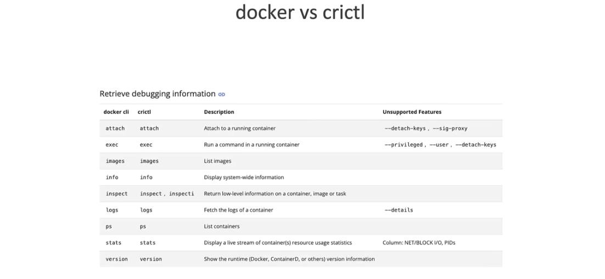<br>
   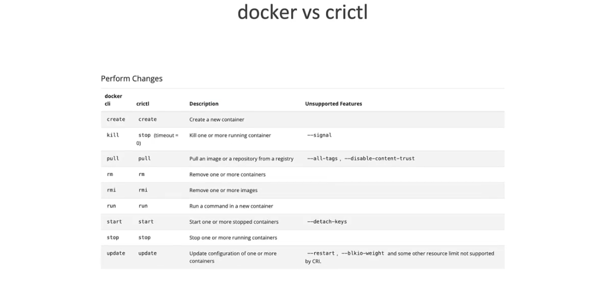<br>


[Status Code](https://github.com/grpc/grpc/blob/master/doc/statuscodes.md) <br>
[Status Code Proto Example](https://github.com/googleapis/googleapis/blob/master/google/rpc/code.proto)


## API Server: 
```Kube-apiserver is responsible for authenticating, validating requests, retrieving and Updating data in ETCD key-value store.  In fact kube-apiserver is the only component that interacts directly to the etcd datastore. The other components such as kube-scheduler, kube-controller-manager and kubelet uses the API-Server to update in the cluster in their respective areas.```

Hello, and welcome to this lecture.In this lecture,we will talk about the kube-apiserver in Kubernetes. Earlier, 
we discussed that the kube-apiserver is the primary management component in Kubernetes.

When you run a kubectl command, the kubectl utility is in fact reaching to the kube-apiserver.The kube-apiserver first authenticates the request and 
validates it.It then retrieves the data from the etcd cluster and responds back with the requested information.

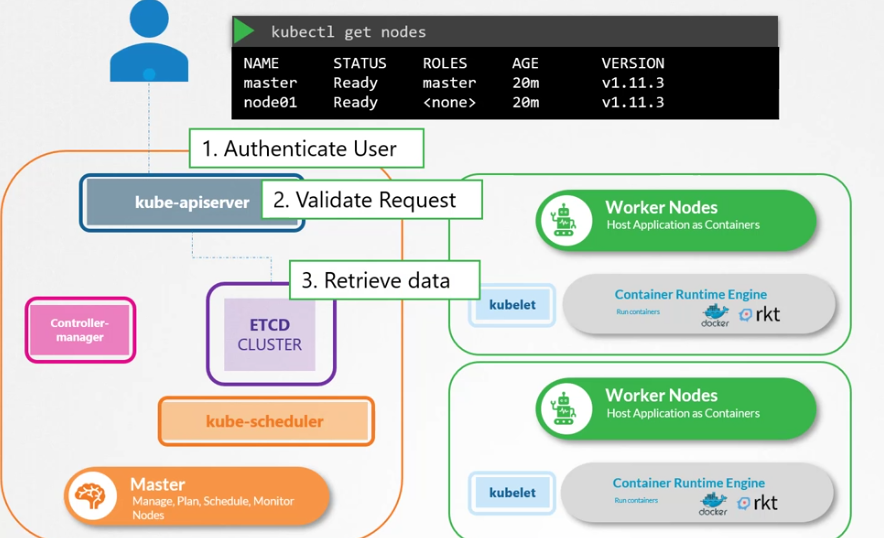<br>

You don't really need to use the kubectl command line. Instead, you could also invoke the APIs directly by sending a POST request 
like this.

Let's look at an example of creating a pod. When you do that, as before,the request is authenticated first and
then validated. In this case, the API server creates a pod object without assigning it to a node.Updates the information in the etcd server,
updates the user that the pod has been created.The scheduler continuously monitors the API server and realizes that 
there is a new pod with no node assigned.

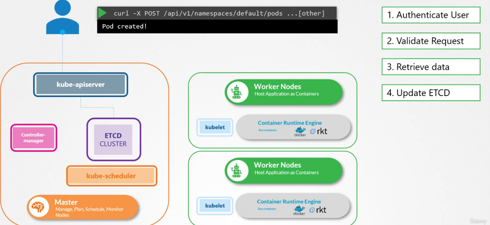<br>

The scheduler identifies the right node to place the new pod on and communicates 
that back to the kube-apiserver.The API server then updates the information in the etcd cluster.The API server then passes 
that information to the kubelet in the appropriate worker node.The kubelet then creates the pod on the node and instructs
the container runtime engine to deploy the application image.

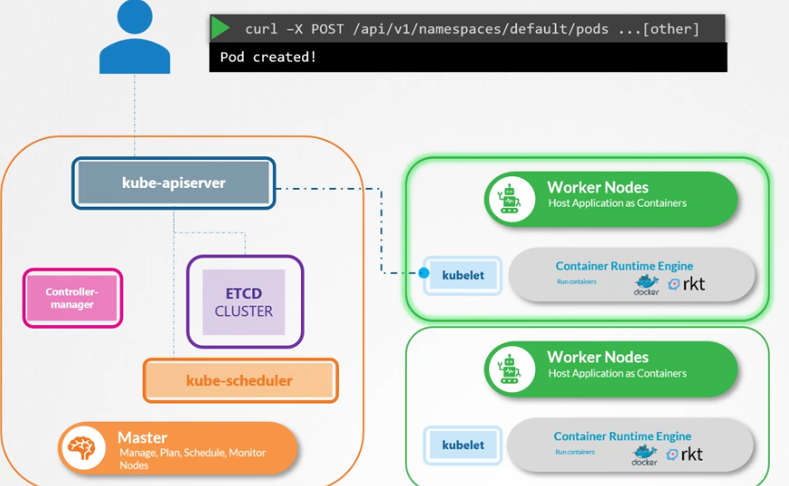<br>

Once done, the kubelet updates the status back to the API server 
and the API server then updates the data back in the etcd cluster.A similar pattern is followed every time a change is 
requested.The kube-apiserver is at the center of all the different tasks that needs to be performed to make a change in 
the cluster.

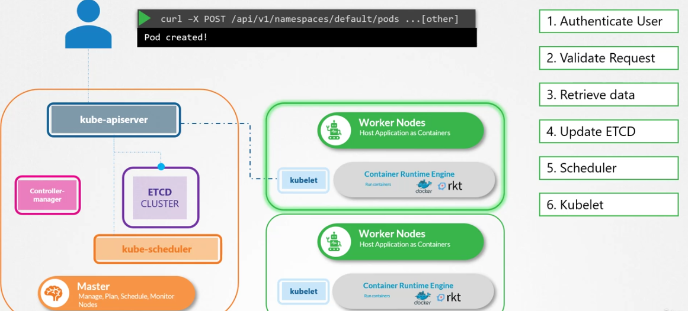<br>

To summarize, the kube-apiserver is responsible for authenticating and validating requests,retrieving and 
updating data in the etcd data store.

In fact, kube-apiserver is the only component that interacts directly with the etcd
data store.

The other components, such as the scheduler,kube-controller-manager and kubelet uses the API server to perform
updates in the cluster in their respective areas.

If you bootstrapped your cluster using kubeadmin tool,then you don't
need to know this but if you're setting up the hardware,then the kube-apiserver is available as a binary in the Kubernetes 
release page.Download it and configure it to run as a service on your Kubernetes master node.

The kube-apiserver is run with a lot of parameters,as you can see here.Throughout this section,we're going to take a peak at how to install and 
configure these individual components of the Kubernetes architecture.You don't have to understand all the options
right now.But I think having a high-level understanding on some of these now will make it easier later when we configure 
the whole cluster and all of its components from scratch.
The Kubernetes architecture consists of a lot of different components
working with each other, talking to each other in many different ways.So they all need to know where the other components are.
There are different modes of authentication, authorization, encryption and security.And that's why you have so many options.
When we go through the relevant section in the course,we will pull up this file and look at the relevant options.For now, 
we will look at a few important ones.  

A lot of them are certificates that are used to secure the connectivity between 
different components.We look at these certificates in more detail when we go through the SSL/TLS certificates lecture later
in this course.There is a whole section just for it.So we'll get rid of them for now.But just remember, all the various 
components we're going to look at in this section will have certificates associated with them.

The option etcd servers is 
where you specify the location of the etcd servers.This is how the kube-apiserver connects to the etcd servers.
So how do you view the kube-apiserver options in an existing cluster? It depends on how you set up your cluster.
If you set it up with a kubeadmin tool,the kubeadmin deploys the kubeadmin-apiserveras a pod in the kube-system namespace 
on the master node.
You can see the options within the pod definition file,located at etc/kubernetes/manifest folder.
In a non-kubeadmin setup,you can inspect the optionsby viewing the kube-apiserver service located at etc/systemd/system/kube-apiserver.service.
You can also see the running process and the effective options by listing the process on the master node and searching for kube-apiserver.
Well, that's it for this lecture.


## Control Manager

Hello and welcome to this lecture.In this lecture, we will talk about Kube Controller Manager.As we discussed earlier the 
Kube controller manager,manages various controllers in Kubernetes.
A controller is like an office or department within the  mastership, that have their own set of responsibilities,such as an office for the ships would be responsible for monitoring 
and taking necessary actions about the ships.Whenever a new ship arrives or when a ship leaves or gets destroyed.

Another office could be one that manages the containers on the ships.They take care of containers that are damaged or fall off ships.
So these offices are number one,continuously on the lookout for the status of the ships and two,takes necessary actions to 
remediate the situation.
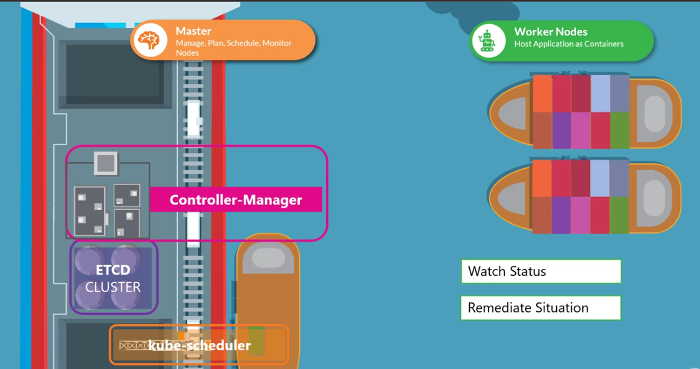<br>        

In the Kubernetes terms a controller is a process that continuously monitors the state of various 
components within the system and works towards bringing the whole system to the desired functioning state.

For example, the node controller is responsible for monitoring the status of the nodes and taking necessary actions to keep the applications
running. It does that through the Kube API server.
The node controller tests the status of the nodes every five seconds.That way the node controller can monitor the health of the nodes.If it stops receiving heartbeat from a node then node is marked 
as unreachable, but it waits for 40 seconds before marking it unreachable.After a node is marked unreachable it gives it five 
minutes to come back up.If it doesn't, it removes the PODs assigned to that node and provisions them on the healthy ones if 
the PODs are part of a replica set.
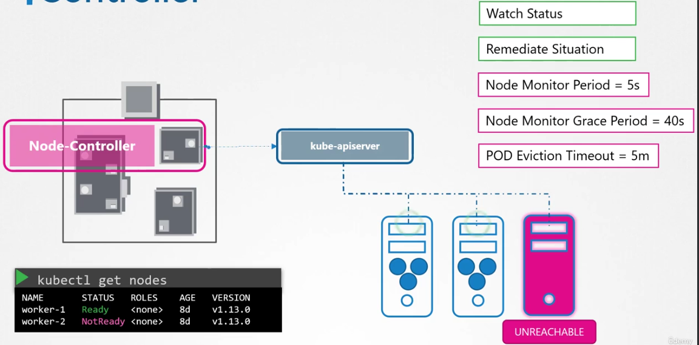<br>
The next controller is the replication controller.It is responsible for monitoring the
status of replica sets and ensuring that the desired number of PODs are available at all times within the set.If a POD dies, 
it creates another one.

Now, those were just two examples of controllers.There are many more such controllers available within 
Kubernetes.Whatever concepts we have seen so far in Kubernetes, such as deployment, services, namespaces or persistent 
volumes and whatever intelligence is built into these constructs, it is implemented through these various controllers.
As you can imagine, this is kind of the brain behind a lot of things in Kubernetes.
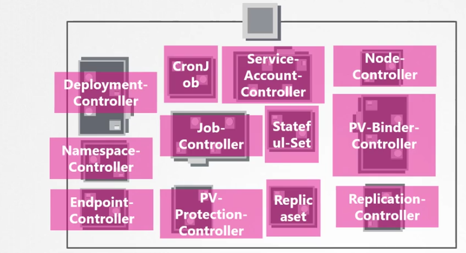<br>
Now, how do you see these controllers and 
where are they located in your cluster?They're all packaged into a single process known as the Kubernetes Controller 
Manager.When you install the Kubernetes controller manager the different controllers get installed as well.So how do you
install and view the Kubernetes controller manager? Download the Kube controller manager from the Kubernetes release page,
extract it and run it as a service.When you run it, as you can see there are a list of options provided.This is where you
provide additional options to customize your controller.
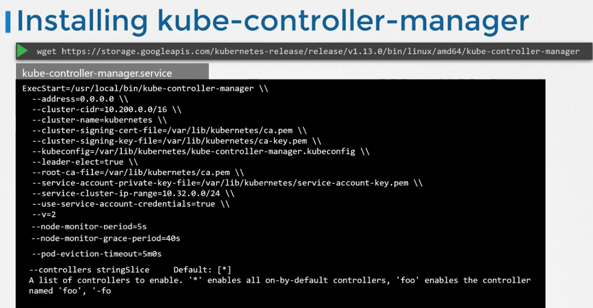<br>
Remember some of the default settings for node controller we discussed 
earlier such as the node monitor period, the grace period and the eviction timeout.These go in here as options.
There is an additional option called controllers that you can use to specify which controllers to enable.By default, all of them are 
enabled, but you can choose to enable and select few.So in case any of your controllers don't seem to work or exist 
this would be a good starting point to look at.

So how do you view the Kube controller managers server options?Again, 
it depends on how you set up your cluster.If you set it up with the Kube admin tool,Kube admin deploys the Kube controller
manager as a POD in the Kube system namespace on the master node.

You can see the options within the POD definition file 
located at Etsy Kubernetes Manifest folder.

In a non Kube admin setup,you can inspect the options by viewing the Kube Controller
Managers service located at the service directory.
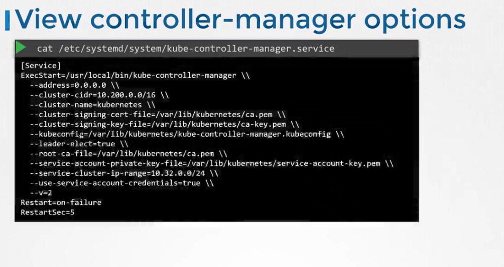<br>
You can also see the running process and the effective options by listing 
the process on the master node and searching for Kube Controller Manager.Well, that's it for this lecture.I will see you in the next.


#  Scheduler: -:
Hello, and welcome to this lecture.
In this lecture, we will talk about kube-scheduler.Earlier, we discussed that the Kubernetes scheduler is responsible for
scheduling pods on nodes.
Now don't let the graphic mislead you. Remember, the scheduler is only responsible for deciding 
which pod goes on which node.It doesn't actually place the pod on the nodes.That's the job of the kubelet.
The kubelet, 
or the captain on the ship,is who creates the pod on the ships.The scheduler only decides which pod goes where.Let's 
look at how the scheduler does that in a bit more detail.

First of all, why do you need a scheduler? When there are many ships and many containers,you wanna make sure that the 
right container ends up on the right ship.For example, there could
be different sizes of ships and containers.You wanna make sure the ship has sufficient capacity to accommodate those containers.
Different ships may be going to different destinations.You wanna make sure your containers are placed on the right ships 
so they end up in the right destination.In Kubernetes, the scheduler decides which nodes the pods are placed on depending 
on certain criteria.You may have pods with different resource requirements.You can have nodes in the cluster dedicated to
certain applications.So how does the scheduler assign these pods?The scheduler looks at each pod and tries to find the best
node for it.For example, let's take one of these pods, the big blue one.It has a set of CPU and memory requirements.The 
scheduler goes through two phases to identify the best node for the pod.In the first phase, the scheduler tries to filter
out the nodes that do not fit the profile for this pod.For example, the nodes that do not have sufficient CPU and memory 
resources requested by the pod.So the first two small nodes are filtered out.So we are now left with the two nodes on which 
the pod can be placed.Now how does the scheduler pick one from the two?The scheduler ranks the nodes to identify the best 
fit for the pod.It uses a priority function to assign a score to the nodes on a scale of zero to 10.For example, the scheduler
calculates the amount of resources that would be free on the nodes after placing the pod on them.In this case, the one on the 
right would have six CPUs free if the pod was placed on it,which is four more than the other one.So it gets a better rank, 
and so it wins.So that's how a scheduler works at a high level.And, of course, this can be customized,and you can write 
your own scheduler as well.There are many more topics to look at,such as resource requirements, limits,taints and tolerations,
node selectors, affinity rules,et cetera, which is why we have an entire section dedicated to scheduling coming up in this 
course where we will discuss each of these in much more detail.For now, we will continue to focus on the scheduler as a 
process at a high level.So how do you install the kube-scheduler?Download the kube-scheduler binary from the Kubernetes 
release page,extract it, and run it as a service.When you run it as a service,you specify the scheduler configuration 
file.So how do you view the kube-scheduler server options?Again, if you set it up with the kubeadm tool,the kubeadm 
tool deploys the kube-scheduler as a pod in the kube system namespace on the master node.You can see the options within 
the pod definition file located at /etc/kubernetes/manifest/folder.You can also see the running process and the effective
options by listing the process on the master node and searching for kube-scheduler.Well, that's it for this lecture.


