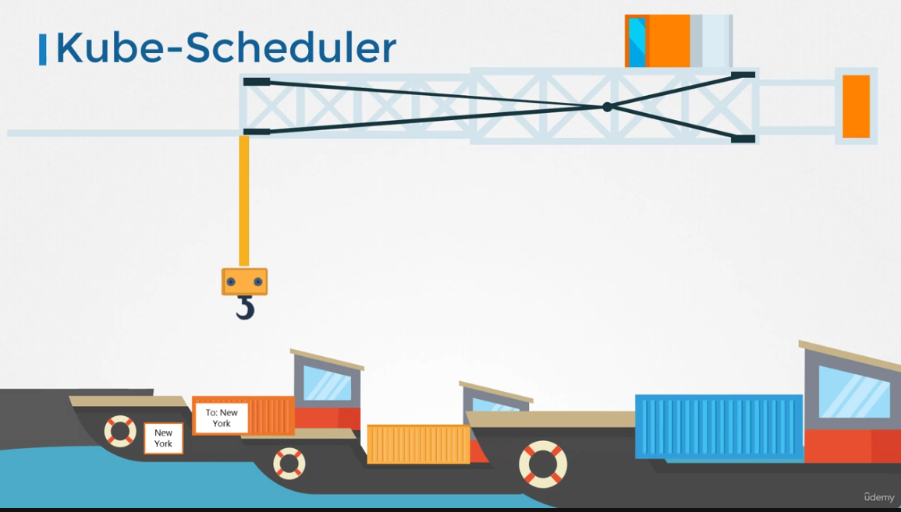
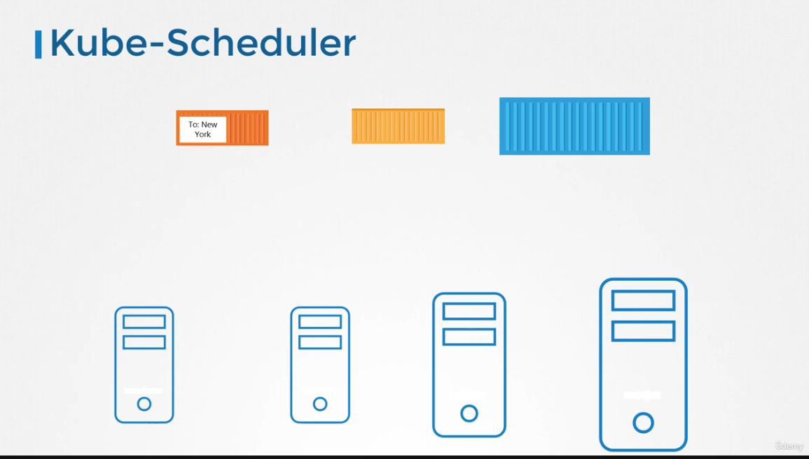
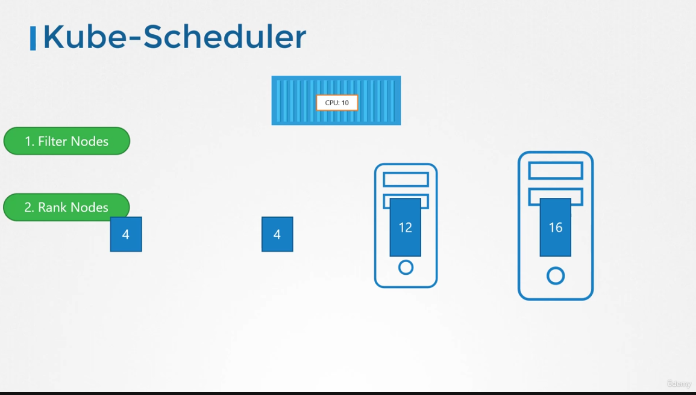
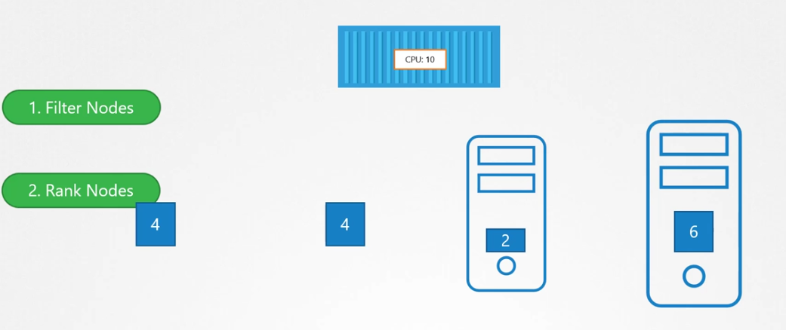
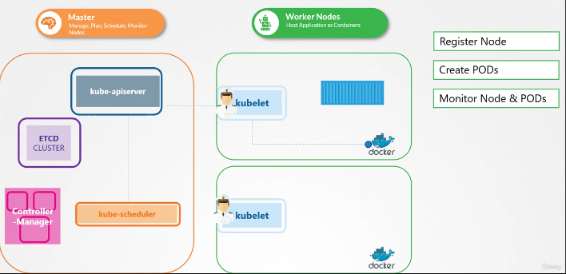
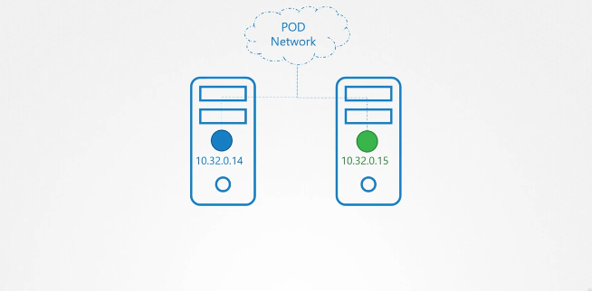
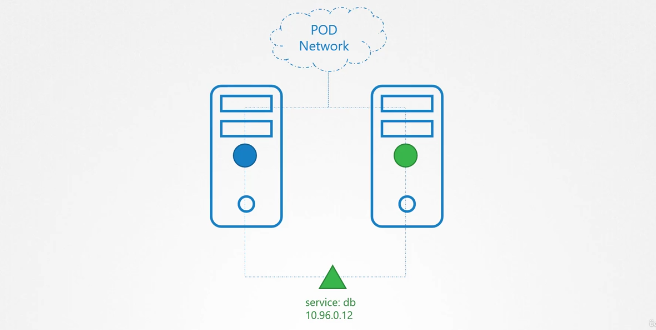
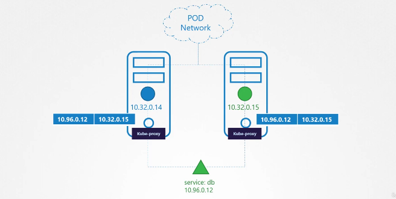

# Core Concepts

### Lecture-12: Docker vs ContainerD

CRI-Container runtime interface: allowed any vendor to work as a container runtime for Kubernetes.

OCI standards: OCI stands for Open Container Initiative, which is a single interface used to connect CRI compatible 
container runtimes, and it consists of an imagespec and a runtimespec.
    1. Imagespec means the specifications on how an image should be built. So that's what it defined. An imagespec
    defined the specifications on how an image should be built,

    2. Runtimespec defined the standards on how any container runtime should be developed.

1. Docker container runtime called runC, the daemon that managed runC that was called as ContainerD.
So Docker is deprecated by k8s in 1.24 release, and containerD can be use as runtime engine. 
2. nerdCTL is docker-like CLI fo contanerD. but you have to use 'nerdctl' keyword instead of 'docker'
  
   <br>
   <br>
   'crictl' control is a command line utility that is used to interact with the CRI compatible container runtime.
3. 
   <br>
   <br>
   <br>


[Status Code](https://github.com/grpc/grpc/blob/master/doc/statuscodes.md) <br>
[Status Code Proto Example](https://github.com/googleapis/googleapis/blob/master/google/rpc/code.proto)


## API Server: 
```Kube-apiserver is responsible for authenticating, validating requests, retrieving and Updating data in ETCD key-value store.  In fact kube-apiserver is the only component that interacts directly to the etcd datastore. The other components such as kube-scheduler, kube-controller-manager and kubelet uses the API-Server to update in the cluster in their respective areas.```

Hello, and welcome to this lecture.In this lecture,we will talk about the kube-apiserver in Kubernetes. Earlier, 
we discussed that the kube-apiserver is the primary management component in Kubernetes.

When you run a kubectl command, the kubectl utility is in fact reaching to the kube-apiserver.The kube-apiserver first authenticates the request and 
validates it.It then retrieves the data from the etcd cluster and responds back with the requested information.

<br>

You don't really need to use the kubectl command line. Instead, you could also invoke the APIs directly by sending a POST request 
like this.

`Let's look at an example of creating a pod. When you do that, as before,the request is (1)authenticated first and
(2) then validated. In this case, the API server _creates a pod object_ without assigning it to a node. (3) Updates the information in the etcd server,
(4) updates the user that the pod has been created. (5) The scheduler continuously monitors the API server and realizes that 
there is a new pod with no node assigned.`

<br>

`The scheduler identifies the right node to place the new pod on and communicates 
that back to the kube-apiserver.The API server then updates the information in the etcd cluster.The API server then passes 
that information to the kubelet in the appropriate worker node.The kubelet then creates the pod on the node and instructs
the container runtime engine to deploy the application image.`

<br>

Once done, the kubelet updates the status back to the API server 
and the API server then updates the data back in the etcd cluster.A similar pattern is followed every time a change is 
requested.`The kube-apiserver is at the center of all the different tasks that needs to be performed to make a change in 
the cluster.`

<br>

To summarize, the kube-apiserver is responsible for authenticating and validating requests,retrieving and 
updating data in the etcd data store.

In fact, kube-apiserver is the only component that interacts directly with the etcd
data store.

The other components, such as the scheduler,kube-controller-manager and kubelet uses the API server to perform
updates in the cluster in their respective areas.

If you bootstrapped your cluster using kubeadmin tool,then you don't
need to know this but if you're setting up the hardware,then the kube-apiserver is available as a binary in the Kubernetes 
release page.Download it and configure it to run as a service on your Kubernetes master node.

The kube-apiserver is run with a lot of parameters,as you can see here.Throughout this section,we're going to take a peak at how to install and 
configure these individual components of the Kubernetes architecture.You don't have to understand all the options
right now.But I think having a high-level understanding on some of these now will make it easier later when we configure 
the whole cluster and all of its components from scratch.
The Kubernetes architecture consists of a lot of different components
working with each other, talking to each other in many different ways.So they all need to know where the other components are.
There are different modes of authentication, authorization, encryption and security.And that's why you have so many options.
When we go through the relevant section in the course,we will pull up this file and look at the relevant options.For now, 
we will look at a few important ones.  

A lot of them are certificates that are used to secure the connectivity between 
different components.We look at these certificates in more detail when we go through the SSL/TLS certificates lecture later
in this course.There is a whole section just for it.So we'll get rid of them for now.But just remember, all the various 
components we're going to look at in this section will have certificates associated with them.

The option etcd servers is 
where you specify the location of the etcd servers.This is how the kube-apiserver connects to the etcd servers.
So how do you view the kube-apiserver options in an existing cluster? It depends on how you set up your cluster.
If you set it up with a kubeadmin tool,the kubeadmin deploys the kubeadmin-apiserver as a pod in the kube-system namespace 
on the master node.
You can see the options within the pod definition file,located at etc/kubernetes/manifest folder.
In a non-kubeadmin setup,you can inspect the optionsby viewing the kube-apiserver service located at etc/systemd/system/kube-apiserver.service.
You can also see the running process and the effective options by listing the process on the master node and searching for kube-apiserver.
Well, that's it for this lecture.


## Control Manager
`Kube Controller Manager manages various controllers in kubernetes. In kubernetes terms, a controller is a process that 
continuously monitors the state of the components within the system and works towards bringing the whole system to the desired functioning state.`

2 main task: 
* Watch status 
* Remediate Solutions

Hello and welcome to this lecture.In this lecture, we will talk about Kube Controller Manager.As we discussed earlier the 
Kube controller manager,manages various controllers in Kubernetes.

A controller is like an office or department within the  mastership, that have their own set of responsibilities,such as an office for the ships would be responsible for monitoring 
and taking necessary actions about the ships.Whenever a new ship arrives or when a ship leaves or gets destroyed.

Another office could be one that manages the containers on the ships.They take care of containers that are damaged or fall off ships.
So these offices are number one,continuously on the lookout for the status of the ships and two,takes necessary actions to 
remediate the situation.

<br>        

In the Kubernetes terms a controller is a process that continuously monitors the state of various 
components within the system and works towards bringing the whole system to the desired functioning state.

For example, the node controller is responsible for monitoring the status of the nodes and taking necessary actions to keep the applications
running. It does that through the Kube API server.
The node controller tests the status of the nodes every five seconds.That way the node controller can monitor the health of the nodes.If it stops receiving heartbeat from a node then node is marked 
as unreachable, but it waits for 40 seconds before marking it unreachable.After a node is marked unreachable it gives it five 
minutes to come back up.If it doesn't, it removes the PODs assigned to that node and provisions them on the healthy ones if 
the PODs are part of a replica set.

<br>

The next controller is the replication controller.It is responsible for monitoring the
status of replica sets and ensuring that the desired number of PODs are available at all times within the set.If a POD dies, 
it creates another one.

Now, those were just two examples of controllers.There are many more such controllers available within 
Kubernetes.Whatever concepts we have seen so far in Kubernetes, such as deployment, services, namespaces or persistent 
volumes and whatever intelligence is built into these constructs, it is implemented through these various controllers.
As you can imagine, this is kind of the brain behind a lot of things in Kubernetes.
<br>
Now, how do you see these controllers and 
where are they located in your cluster?They're all packaged into a single process known as the Kubernetes Controller 
Manager.When you install the Kubernetes controller manager the different controllers get installed as well.So how do you
install and view the Kubernetes controller manager? Download the Kube controller manager from the Kubernetes release page,
extract it and run it as a service.When you run it, as you can see there are a list of options provided.This is where you
provide additional options to customize your controller.
<br>
Remember some of the default settings for node controller we discussed 
earlier such as the node monitor period, the grace period and the eviction timeout.These go in here as options.
There is an additional option called controllers that you can use to specify which controllers to enable.By default, all of them are 
enabled, but you can choose to enable and select few.So in case any of your controllers don't seem to work or exist 
this would be a good starting point to look at.

So how do you view the Kube controller managers server options?Again, 
it depends on how you set up your cluster.If you set it up with the Kube admin tool,Kube admin deploys the Kube controller
manager as a POD in the Kube system namespace on the master node.

You can see the options within the POD definition file 
located at Etsy Kubernetes Manifest folder.

In a non Kube admin setup,you can inspect the options by viewing the Kube Controller
Managers service located at the service directory.

<br>

You can also see the running process and the effective options by listing 
the process on the master node and searching for Kube Controller Manager.Well, that's it for this lecture.I will see you in the next.


#  Scheduler: -:
Hello, and welcome to this lecture.
In this lecture, we will talk about kube-scheduler.Earlier, we discussed that the Kubernetes scheduler is responsible for
scheduling pods on nodes.
`Now don't let the graphic mislead you. Remember, the scheduler is only responsible for deciding 
which pod goes on which node.It doesn't actually place the pod on the nodes.That's the job of the kubelet.`

The kubelet, or the captain on the ship,is who creates the pod on the ships.The scheduler only decides which pod goes where.Let's 
look at how the scheduler does that in a bit more detail.

First of all, why do you need a scheduler? When there are many ships and many containers,you wanna make sure that the 
right container ends up on the right ship.For example, there could
be different sizes of ships and containers.You wanna make sure the ship has sufficient capacity to accommodate those containers.
Different ships may be going to different destinations. You wanna make sure your containers are placed on the right ships 
so they end up in the right destination.
        
<br>

In Kubernetes, the scheduler decides which nodes the pods are placed on depending 
on certain criteria.You may have pods with different resource requirements.You can have nodes in the cluster dedicated to
certain applications.So how does the scheduler assign these pods?The scheduler looks at each pod and tries to find the best
node for it.For example, let's take one of these pods, the big blue one.It has a set of CPU and memory requirements.The 
scheduler goes through **two phases** to identify the best node for the pod.In the _first phase_, the scheduler tries to filter
out the nodes that do not fit the profile for this pod.
        
<br>

For example, the nodes that do not have sufficient CPU and memory 
resources requested by the pod.So the first two small nodes are filtered out.So we are now left with the two nodes on which 
the pod can be placed.Now how does the scheduler pick one from the two? Second Phase _The scheduler ranks the nodes_ to identify the best 
fit for the pod. It uses a priority function to assign a score to the nodes on a scale of zero to 10. For example, the scheduler
calculates the amount of resources that would be free on the nodes after placing the pod on them.
    
<br>

In this case, the one on the 
right would have six CPUs free if the pod was placed on it,which is four more than the other one.So it gets a better rank, 
and so it wins.So that's how a scheduler works at a high level.
        
<br>

And, of course, this can be customized,and you can write 
your own scheduler as well.`There are many more topics to look at,such as resource requirements, limits, taints and tolerations,
node selectors, affinity rules,etcetera,` which is why we have an entire section dedicated to scheduling coming up in this 
course where we will discuss each of these in much more detail.
For now, we will continue to focus on the scheduler as a 
process at a high level.So how do you install the kube-scheduler?
##### download and install
Download the kube-scheduler binary from the Kubernetes 
release page,extract it, and run it as a service.When you run it as a service,you specify the scheduler configuration 
file.So how do you view the kube-scheduler server options?Again, if you set it up with the kubeadmin tool,`the kubeadmin
tool deploys the kube-scheduler as a pod in the kube system namespace on the master node`.You can see the options within 
the pod definition file located at /etc/kubernetes/manifest/folder.You can also see the running process and the effective
options by listing the process on the master node and searching for kube-scheduler.Well, that's it for this lecture.


## Kubelet
Hello, and welcome to this lecture.In this lecture, we will look at kubelet.Earlier, we discussed that the kubelet is like
the captain on the ship.They lead all activities on a ship.They're the ones responsible for doing all the paperwork necessary 
to become part of the cluster.They're the sole point of contact from the mastership.They load or unload containers
on the ship as instructed by the scheduler on the master.They also send back reports at regular intervals on the status 
of the ship and the containers on them.

The kubelet in the Kubernetes worker node registers the node with a Kubernetes
cluster.When it receives instructions to load a container or a pod on the node,it requests the container runtime engine,
which may be Docker, to pull the required image and run an instance.

The kubelet then continues to monitor the state
of the pod and containers in it and reports to the kube API server on a timely basis.

<br>

So how do you install the kubelet?
If you use the kubeadmin tool to deploy your cluster,it does not automatically deploy the kubelet.Now that's the difference
from other components.You must always manually install the kubelet on your worker nodes.Download the installer, extract it,
and run it as a service.

You can view the running kubelet process and the effective options by listing the process on
the worker node and searching for kubelet.We will look more into kubelets, how to configure kubelets,generate certificates,
and, finally,how to TLS Bootstrap `kubelets` later in this course.That's it for now.I will see you in the next lecture.


## Kube Proxy
Hello, and welcome to this lecture.In this lecture, we will talk about kube-proxy.Within a Kubernetes cluster,
every pod can reach every other pod.This is accomplished by deploying a pod networking solution to the cluster.
A pod network is an internal virtual network that spans across all the nodes in the cluster to which all the pods connect to.


Through this network,they're able to communicate with each other.There are many solutions available for deploying such a network.
In this case, I have a web application deployed on the first node and a database application deployed on the second.

<br>

The web app can reach the database simply by using the IP of the pod, but there is no guarantee that the IP of 
the database pod will always remain the same.If you've gone through the lecture on services,as discussed in the beginner's course,
you must know that a better way for the web application to access the database is using a service.

So we create a service 
to expose the database application across the cluster.The web application can now access the database using the name of the service, DB.

The service also gets an IP address assigned to it.
Whenever a pod tries to reach the service using its IPor name, 
it forwards the traffic to the backend pod,in this case, the database.

But what is this service, and how does it get an IP?
Does the service join the same pod network? The service cannot join the pod network because the service is not an actual thing.

<br>

It is not a container like pods,so it doesn't have any interfaces or an actively listening process.It is a virtual component 
that only lives in the Kubernetes memory.But then, we also said that the service should be accessible across the cluster from any nodes.
So how is that achieved?That's where kube-proxy comes in. `Kube-proxy is a process that runs on each node in the Kubernetes cluster`.

`Its job is to look for new services,and every time a new service is created,it creates the appropriate rules on each node to forward 
traffic to those services to the backend pods. One way it does this is using iptables rules. In this case,it creates an iptables
rule on each node in the cluster to forward traffic heading to the IP of the service, which is 10.96.0.12,to the IP of the 
actual pod, which is 10.32.0.15.`

<br>

So that's how kube-proxy configures a service.We discuss lot more about networking, 
and services,and kube-proxy, and pod networking later in this course.Again, we have a large section just for networking.
This is a high-level overview for now.We will now see how to install kube-proxy.

Download the kube-proxy binary from the 
Kubernetes release page, extract it,and run it as a service.`The kubeadm tool deploys kube-proxy as pods on each node`.
`In fact, it is deployed as a DaemonSet,so a single pod is always deployed on each node in the cluster`.

Well,
if you don't know about DaemonSet yet, don't worry.We have a lecture on that coming up in this course.
We have now covered a high-level overview of the various components in the Kubernetes control plane.As mentioned,
we will look at some of these in much more detail at various sections in this course.Well, that's it for this lecture.
I will see you in the next section.


# Pods

Hello and welcome to this lecture on Kubernetes pods.Before we head into understanding pods,we would like to 
assume that the following have been set up already. At this point,we assume that the application is already developed and 
built into Docker images, and it is available on a Docker repository like Docker Hub so Kubernetes can pull it down. We also 
assume that the Kubernetes cluster has already been set up and is working.This could be a single-node setup or a multi-node 
setup.Doesn't matter.All the services need to be in a running state.

As we discussed before,with Kubernetes, our ultimate 
aim is to deploy our application in the form of containers on a set of machines that are configured as worker nodes in a cluster.

However, Kubernetes does not deploy containers directly on the worker nodes.The containers are encapsulated into a 
Kubernetes object known as pods.

A pod is a single instance of an application.A pod is the smallest object that you can create 
in Kubernetes.
Here we see the simplest of simplest cases where you have a single-node Kubernetes cluster with a single instance 
of your application running in a single Docker container encapsulated in a pod.What if the number of users accessing your 
application increase and you need to scale your application?You need to add additional instances of your web application to 
share the load.Now, where would you spin up additional instances? Do we bring up new container instance within the same pod?

`The shared context of a Pod is a set of Linux namespaces, cgroups, and potentially other facets of isolation - the same things that isolate a container.`

No, we create new pod altogether with a new instance of the same application.As you can see, we now have two instances of 
our web application running on two separate pods on the same Kubernetes system or node.What if the user base further 
increases and your current node has no sufficient capacity?Well, then you can always deploy additional pods on a new 
node in the cluster.You will have a new node added to the cluster to expand the cluster's physical capacity.So what 
I'm trying to illustrate in this slide is that pods usually have a one-to-one relationship with containers running your
application.To scale up, you create new pods,and to scale down, you delete existing pod.You do not add additional 
containers to an existing pod to scale your application.Also, if you're wondering how we implement all of this and 
how we achieve load balancing between the containers etc,we will get into all of that in a later lecture.For 
now, we are only trying to understand the basic concepts.We just said that pods usually have a one-to-one relationship with
the containers,but are we restricted to having a single container in a single pod?No, a single pod can have multiple 
containers except for the fact that they're usually not multiple containers of the same kind.As we discussed in the previous slide,
if our intention was to scale our application,then we would need to create additional pods,but sometimes you might have a
scenario where you have a helper container that might be doing some kind of supporting task for our web application such as
processing a user and their data,processing a file uploaded by the user, etc and you want these helper containers to 
live alongside your application container.In that case,you can have both of these containers part of the same pod so that 
when a new application container is created,the helper is also created,and when it dies, the helper also dies since they're
part of the same pod.The two containers can also communicate with each other directly by referring to each other as local 
host since they share the same network space,plus they can easily share the same storage space as well.If you still have 
doubts in this topic,I would understand if you did because I did the first time I learned these concepts.We could take 
another shot at understanding pods from a different angle.Let's, for a moment, keep Kubernetes out of our discussion and 
talk about simple Docker containers.Let's assume we were developing a process or a script to deploy our application on a 
Docker host.Then we would first simply deploy our application using a simple Docker run Python app command and the 
application runs fine and our users are able to access it.When the load increases,we deploy more instances of our 
application by running the Docker run commands many more times.This works fine,and we are all happy.Now, sometime in the
future,our application is further developed,undergoes architectural changes and grows and gets complex.We now have a new 
helper container that helps our web application by processing or fetching data from elsewhere.These helper containers 
maintain a one-to-one relationship with our application container and thus needs to communicate the application containers
directly and access data from those containers.For this, we need to maintain a map of what app and helper containers are 
connected to each other.We would need to establish network connectivity between these containers ourselves using links and
custom networks.We would need to create shareable volumes and share it among the containers.We would need to maintain a 
map of that as well,and most importantly, we would need to monitor the state of the application container and when it 
dies,manually kill the helper container as well as it's no longer required.When a new container is deployed,we would
need to deploy the new helper container as well.With pods, Kubernetes does all of this for us automatically.
We just need to define what containers a pod consists of and the containers in a pod by default will have access to the
same storage,the same network namespace and same fit as in they will be created together and destroyed together.
Even if our application didn't happen to be so complex and we could live with a single container,Kubernetes still 
requires you to create pods,but this is good in the long runas your application is now equipped for architectural 
changes and scale in the future.However, also note that multi containers pods are a rare use case,and we are going to
stick to single containers per pod in this course.Let's us now look at how to deploy pods.Earlier we learned about the
kubectl run command.What this command really does is it deploys a Docker container by creating a pod,so it first creates
a pod automatically and deploys an instance of the NGINX Docker image,but where does it get the application image from?
For that, you need to specify the image name using the dash dash image parameter.The application image,in this case,
the NGINX image,is downloaded from the Docker Hub repository.Docker Hub, as we discussed, is a public repository where 
latest Docker images of various applications are stored.You could configure Kubernetes to pull the image from the public 
Docker Hub or a private repository within the organization.Now that we have a pod created,how do we see the list of pods 
available?The kubectl get pods command helps us see the list of pods in our cluster.In this case,we see the pod is in a 
container creating state and soon changes to a running state when it is actually running.Also, remember that we haven't 
really talked about the concepts on how a user can access the NGINX web server,and so in the current state,we haven't made
the web server accessible to external users.You can, however, access it internally from the node.For now, we will just 
see how to deploy a pod,and in a later lecture,once we learn about networking and services,we will get to know how to 
make this service accessible to end users.That's it for this lecture.


## Pods with YAML


