# Scalar Types

### Java Types   vs    Proto Types
        int     -->     int32/sin32
        long    -->     int64/sin64
        float   -->     float
        double  -->     double
        boolean -->     bool
        String  -->     string
        byte[]  -->     bytes

These are the basic building blocks in proto using which we can model our message. Then using that message by using composition
we can create further complex message if you want.

Serialization is super simple with the proto generated source

### Important: Proto will replace JSON. Proto represent the data which we are planning to send to another service.

One of the best feature of Proto is it doesnt support NULL.

### oneOf
one server S1 calling another server S2, that S2 server will return response, this response will be GENERIC type,
it could be SUCCESS response or it could be FAILURE response. I will be getting one of these types. that is why it is 
called oneOf.c
"oneOf" behavior can also be achieved with latest version of java using sealed class and pattern matching.

### proto message format changes
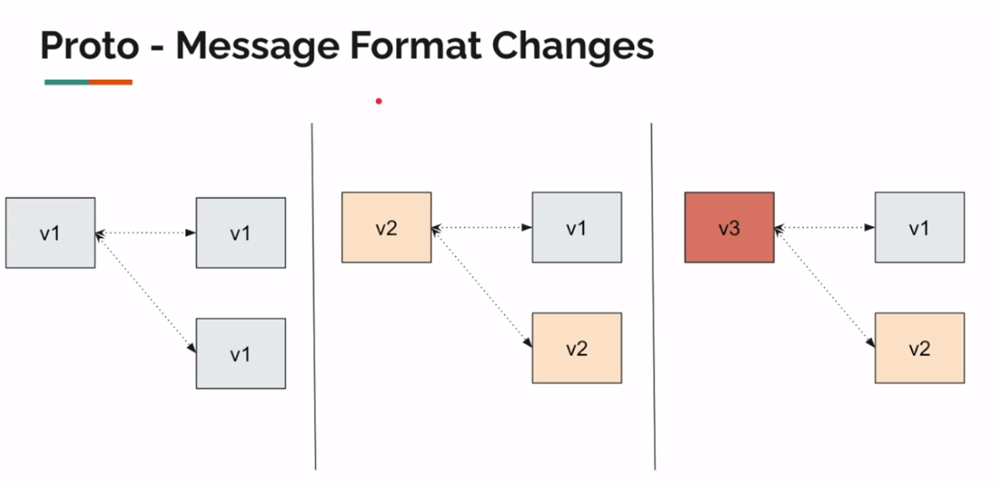


# Unary
gRPC ia lightweight framework for developing high performance client-server application.

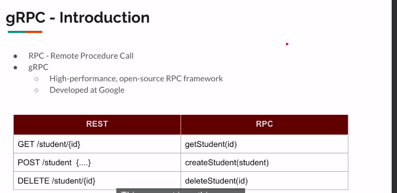<br>
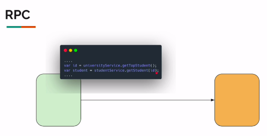<br>
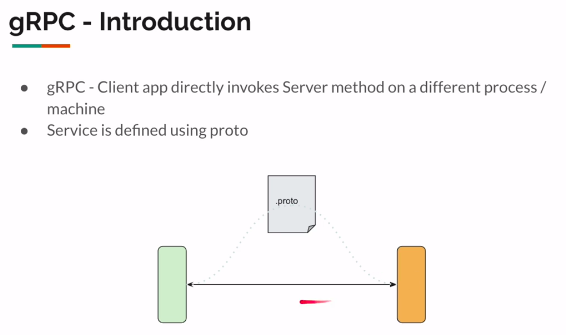<br>
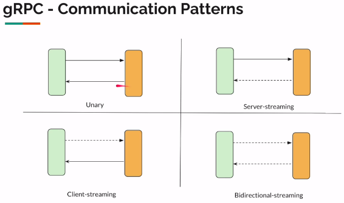<br>
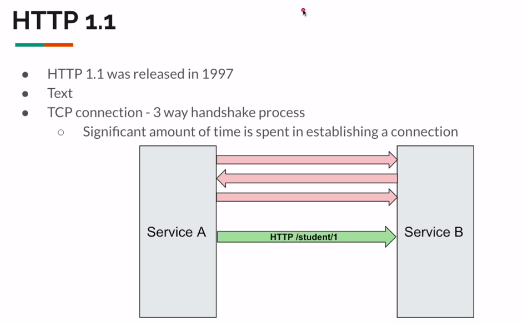<br>

[//]: # (![alt text]&#40;images/unary/http1_ss6.png&#41;<br>)

In HTTP1.1, 
1. use text based.
2. Three ways handshake.
3. we can only process ONE request in on TCP connection and every web based framework use ThreadPool to handle
lots of request, in spring its size is 200, if the request exceeded 200 then remain request will be queued and wait until 
any other thread is release/completed. while HTTP2 we can process multiple request and main benefit of HTTP2 is Binary and Multiplexing. Multiplexing mean we can send multiple request to process via one single TCP connection.

NB: There is a problem, server like Netty is not support HTTP2 that is why Google is working on HTTP3.

<br>
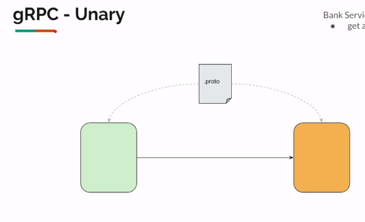<br>

BankServiceGrpc uses void method, this is actually use reactive programming, where responseObserver keep emitting values
when we want. this is not typical Request and Response base service. it is like single request and multiple response.

```
@Override
public void getAccountBalance(BalanceCheckRequest request, StreamObserver<AccountBalance> responseObserver) {
 
 }

```
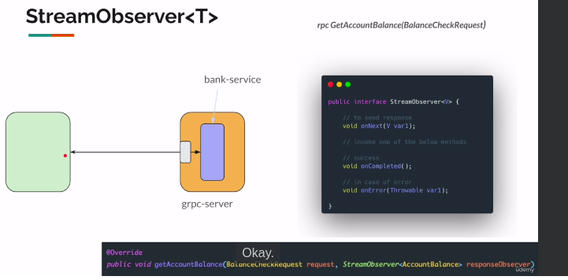<br>

we have created the service class now it has to be registered with the gRPC server. For that I've created one package called
`com.altuhin.grpc.common`


```
public class BankService extends BankServiceGrpc.BankServiceImplBase {
    @Override
    public void getAccountBalance(BalanceCheckRequest request, StreamObserver<AccountBalance> responseObserver) {
        int accountNumber = request.getAccountNumber();
        AccountBalance accountBalance = AccountBalance.newBuilder()
                .setBalance(accountNumber * 10)
                .build();

        responseObserver.onNext(accountBalance);
        responseObserver.onCompleted();
    }
}

public class GrpcServer {
    public static void main(String[] args) throws Exception {
        Server server = ServerBuilder.forPort(6565)
                .addService(new BankService())
                .build();

        server.start();
        server.awaitTermination();
    }
}

```
by default HTTP2 requires secured connection, when a client is interacts with server sung HTTP2, it assumes that server
is using the secured connection. so we have to explicitly say to postman to disable TLS.

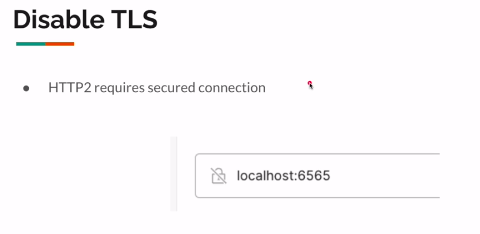<br>

Client Server communication:
proto actually also generate some Client code for us to invoke that method.
What are we going to do?
Here, we have a server builder to build te server. Then we added the service to expose the API.

Similarly, we have something called a channel builder in the client side to build a channel. so the channel is nothing but a connection
between the client and the server. and Stub is nothing but a fake service. and proto generate this Stub for us.

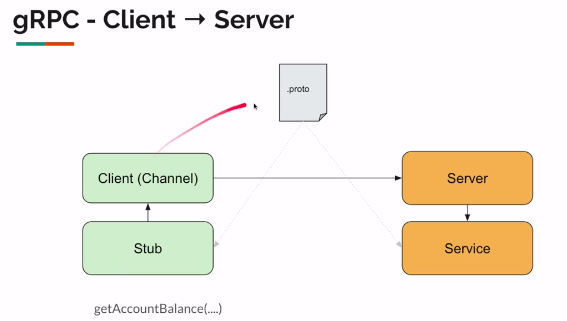<br>

## Channel and Stub
    Channel:
--------------
    1. Channel should be mostly private
    2. we create once in the beginning of the application
    3. It is "managed"

    Stub
-----------
    1. stub uses channel, create once and inject wherever we need
    2. Singleton/ @Bean
    3. It is thread safe

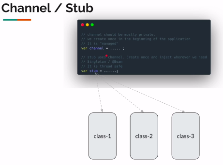<br>

## Blocking vs Async Stub

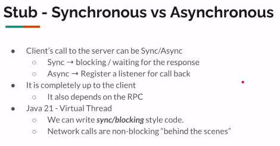<br>

## How Async Stub works
-----
Synchronous blocking client very simple and straightforward, but when we use asynchronous client we have to attach a listener
so that when the response come back, maybe after one second, maybe after 10s, that can be executed.
Steps: Stub will send the request to the server via Client -> Server will receive the request -> Server will pass the request to 
Service class. also ot will pass the stream observer implementation of the service class  -> Server will give TWO parameter
to the service method, one is the Request, second one is the stream observer implementation -> using stream
observer, via OnNext() method we will give the response back-> server take the response -> forward back to client -> client receive the 
response via onNext() method.

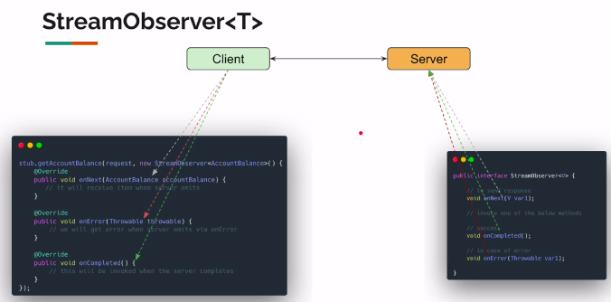<br>

#### Listenable Future
var stub = BankServiceGrpc.newFutureStub(channel);

Note:
newFutureStub() and newBlockingStub(): support unary and  server streaming
newStub()- asynchronous: support all 4 communication pattern


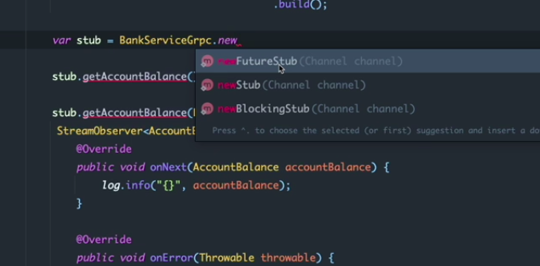<br>

# Server Streaming 
#### Client will send on request where Server might send multiple response
#### Streaming possible Outputs
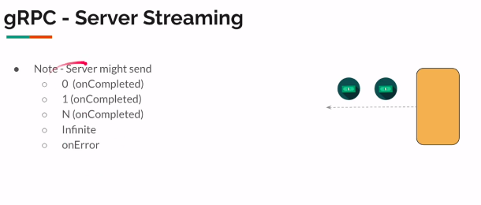<br>


# Client Streaming 
#### Client will send on stream of request where Server return response

#### Why we return Stream Observer?f
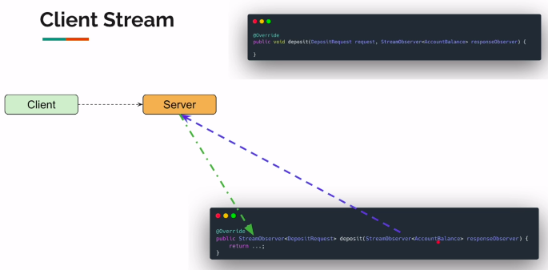<br>

# Bidirectional Streaming 
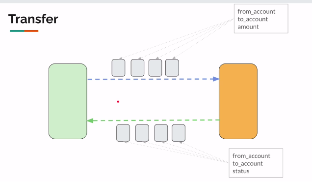<br>

#### Independent Stream
for every one incoming message, send back any number outgoing message
for every any incoming message, send back any number outgoing message

#### Interactive Stream
Client cannot keep on making moves without knowing the other side move (Server response)

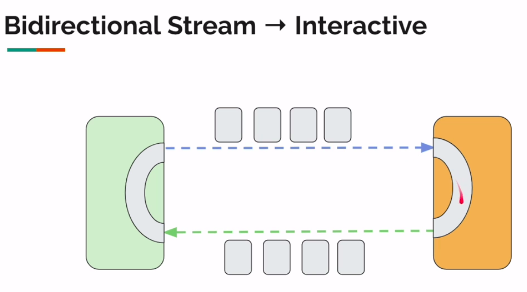<br>


# Input Validation/Error Handling
[Status Code](https://github.com/grpc/grpc/blob/master/doc/statuscodes.md) <br>
[Status Code Proto Example](https://github.com/googleapis/googleapis/blob/master/google/rpc/code.proto)